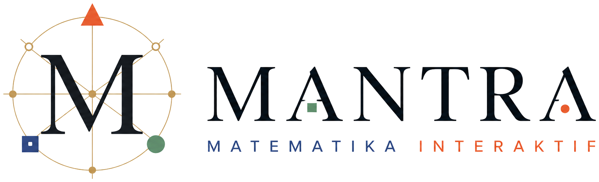

<div align="center">

<picture>
  <source media="(prefers-color-scheme: dark)" srcset="web/public/mantra/mantra-penuh-gelap.png">
  
</picture>

**Situs belajar matematika SMA berbahasa Indonesia.**
Tiap materi dibuka dengan animasi yang menjelaskan *kenapa*, lalu siswa diberi
alat untuk mengujinya sendiri, kemudian latihan dan kuis.

[**Buka situsnya**](https://mantra-matematika.vercel.app) ·
[Alamat lama](https://matra-eight.vercel.app) ·
Tanpa akun, tanpa basis data

</div>

---

## Kenapa situs ini ada

Kebanyakan siswa bisa memakai rumus tanpa pernah diperlihatkan dari mana rumus
itu datang. MANTRA mencoba membalik urutannya: lihat dulu kejadiannya, baru
rumusnya muncul sebagai catatan dari kejadian itu.

Karena itu tiap materi punya tiga lapis:

| Lapis | Isinya |
|---|---|
| **Animasi** | Video pendek bersuara dan bersubtitle, dibuat dengan ManimGL. Rumus digambar dari langkah awalnya, bukan ditampilkan jadi |
| **Alat interaktif** | Segitiga yang bisa ditarik, sudut yang bisa digeser, angka yang berubah seketika. Siswa menguji sendiri, bukan percaya kalimat di buku |
| **Latihan dan kuis** | Soal berjenjang dengan pembahasan langkah demi langkah, kemajuannya tersimpan di peramban siswa |

## Isinya sekarang

| | Jumlah |
|---|---:|
| Bab | 7 |
| Materi | 81 |
| Alat interaktif | 92 |
| Video animasi | 49 |
| Soal kuis | 208 |
| Soal latihan | 30 |

Tujuh babnya: Perbandingan Trigonometri, Vektor dan Operasinya, Grafik Fungsi,
Statistika, Limit, Ruang Tiga Dimensi, dan Transformasi Geometri.

## Menjalankan di komputer sendiri

**Situsnya:**

```bash
cd web
npm install
npm run dev
```

Lalu buka http://localhost:3000

**Animasinya** (perlu Python 3.11, ManimGL 1.7.2, MiKTeX, dan FFmpeg):

```bash
manimgl manim/scenes/<berkas>.py <NamaScene> -w -l
```

Hasilnya masuk ke `media/gl/`. Sebelum sebuah video dinyatakan selesai, ia
wajib lolos `python manim/cek_video.py <video>` dan diperiksa lembar
kontaknya frame demi frame. "Rendered" di log bukan bukti videonya benar.

## Susunan folder

| Folder | Isinya |
|---|---|
| `web/` | Situs Next.js 16 dan TypeScript. Isi materi ada di `web/content/` |
| `manim/` | Animasi Python berbasis ManimGL. Perkakas bersama di `manim/gl/` |
| `docs/` | Dokumen rancangan, termasuk rancangan visual MANTRA v2 |
| `alat/` | Alat bantu di luar Manim, misalnya pemeriksa mutu video |
| `audio/` | Narasi suara untuk tiap video |

## Yang dipakai membangunnya

**Next.js 16** dan **React 19** untuk situsnya, **Tailwind v4** untuk gayanya,
**ManimGL** untuk animasinya, dan **Claude** untuk menyusun kode, alat
interaktif, serta naskah materi. Suara narasi memakai mesin ubah-teks-jadi-suara.

Rujukan isinya: Buku Panduan Guru Kurikulum Merdeka, diktat kalkulus ITB, dan
Stewart. Soal salinan selalu disertai sumbernya; yang tanpa keterangan adalah
tulisan sendiri.

## Beberapa aturan yang dipegang

- **Tanpa akun, tanpa basis data.** Semua kemajuan tersimpan di `localStorage`
  peramban siswa dan tidak pernah dikirim ke mana pun.
- **Lebar halaman tidak pernah dipatok piksel.** Isinya harus tetap memenuhi
  layar saat peramban di-zoom keluar.
- **Bahasanya bahasa SMA**, bukan bahasa diktat. Istilah guru seperti
  "miskonsepsi" tidak pernah muncul ke siswa; yang dipakai "Sering keliru",
  dan letaknya di bawah setelah siswa paham.
- **Warna matematika dikunci** dan sama persis antara situs dan video, supaya
  gambar di situs tidak membantah gambar di video.

Aturan lengkapnya ada di [`CLAUDE.md`](CLAUDE.md), dan status hariannya di
[`PROGRESS.md`](PROGRESS.md).

## Yang masih dikerjakan

- **33 video masih 480p.** Itu mutu draf untuk ditinjau; render 1080p menyusul.
- **Bank soal menu Latihan masih satu kumpulan dengan kuis bab.** Kuis sudah
  mendahulukan soal yang belum pernah dikerjakan siswa di bank soal, tetapi
  keduanya belum benar-benar terpisah.
- Kredit suara di halaman Tentang menyebut ElevenLabs, sedangkan video yang
  ada sekarang masih memakai mesin suara sebelumnya.

## Dibuat oleh

**Nyoman Arya Sejati**, Universitas Pendidikan Ganesha.

Skor dan kemajuan di situs ini bukan nilai resmi sekolah.
